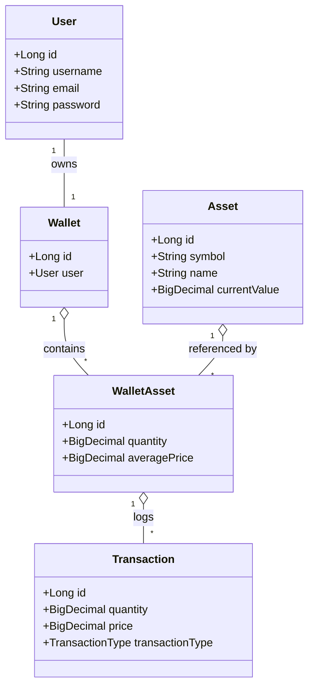
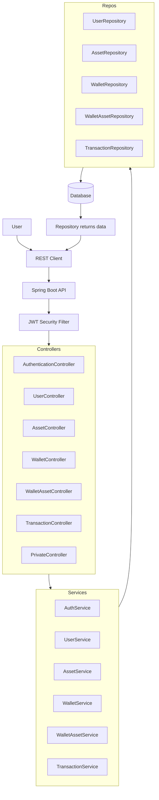

# Sprint - Webservice API

Este projeto é uma API RESTful desenvolvida em Java com Spring Boot para gerenciamento de usuários, ativos (assets), carteiras (wallets) e transações financeiras, incluindo funcionalidades de autenticação JWT e operações de compra, venda, atualização e listagem de ativos em carteiras.

**Nomes + RM dos integrantes:**

* Fabrício Saavedra - 97631
* Guilherme Akio - 98582
* Guilherme Morais - 551981
* Açussena Macedo Mautone - 552568

**Turma:** 3ESPY
**Ano:** 2025

## Tecnologias

* Java 21
* Spring Boot
* Spring Data JPA
* Hibernate
* H2 Database (para desenvolvimento/testes)
* Spring Security com JWT
* BCrypt Password Encoder
* Maven

## Pré-requisitos

* JDK 21 instalado
* Maven instalado
* IDE de sua preferência (IntelliJ, Eclipse, VS Code)

## Configuração

1. Clone o repositório
    ```bash
    git clone https://github.com/Guimeb/Java-API
    ```

2. Caso necessario juste as propriedades de `src/main/resources/application.properties` ou `application.yml`:

    ```properties
    spring.datasource.url=jdbc:h2:mem:testdb
    spring.datasource.driver-class-name=org.h2.Driver
    spring.datasource.username=galo
    spring.datasource.password=

    # JWT
    jwt.public-key-location=classpath:app.pub
    jwt.private-key-location=classpath:app.key
    ```

## Executando a aplicação

```bash
mvn clean spring-boot:run
```

Acesse `http://localhost:8080/swagger-ui/index.html#/` para a documentação interativa em swagger, e `http://localhost:8080/h2-console` para a base de dados.

Conta para autenticação:
Usuário: galo
Senha: password

URL para alterar no H2:
jdbc:h2:mem:testdb
Usuário: galo

## Execução de Endpoints

> **Observação:** O usuário de `id = 1` é apenas para autenticação inicial, não possui wallet nem assets vinculados.

Há uma ordem necessária para o uso dos endpoints:

1. **Autenticação**

   * Use o endpoint `/authenticate` para gerar o token JWT.

2. **Criar um usuário**

   * Ao criar um usuário via `/users`, uma *wallet* é automaticamente gerada.

3. **Criar um Asset (Ação)**

   * Crie ativos via `/assets` para permitir movimentações futuras na carteira.

4. **Adicionar Ativos à Carteira (WalletAsset)**

   * Utilize os endpoints `buy` e `sell` para movimentar os ativos nas wallets.

> Caso não seja cumprida esta ordem, o código pode retornar "internal error".

---

### Autenticação

* **POST** `/authenticate`

  * **Descrição:** Autentica usuário e retorna token JWT.
  * **Request Body:**

    ```json
    {
      "username": "galo",
      "password": "password"
    }
    ```
  * **Response:**

    ```json
    {
      "token": "eyJhbGciOiJI...",
      "type": "Bearer"
    }
    ```

---

### Usuários (User)

* **POST** `/users`

  * Cria um usuário e automaticamente uma carteira associada.
  * Body:

    ```json
    {
      "username": "alice",
      "email": "alice@example.com",
      "password": "SenhaForte123!"
    }
    ```

* **GET** `/users`

  * Lista todos os usuários.

* **GET** `/users/{id}`

  * Busca usuário por ID.

* **PUT** `/users`

  * Atualiza dados do usuário.

    ```json
    {
      "id": 1,
      "username": "alice2",
      "email": "alice2@example.com",
      "password": "NovaSenha!"
    }
    ```

* **DELETE** `/users/{id}`

  * Remove usuário.

---

### Ativos (Asset)

* **POST** `/assets`

  ```json
  {
    "symbol": "BTC",
    "name": "Bitcoin",
    "currentValue": 60000.00
  }
  ```

* **GET** `/assets`

  * Lista todos os ativos.

* **GET** `/assets/{id}`

  * Busca ativo por ID.

* **PUT** `/assets`

  * Atualiza ativo.

* **DELETE** `/assets/{id}`

  * Remove ativo.

---

### Carteiras (Wallet)

* **GET** `/users/{userId}/wallet`

  * Retorna a carteira de um usuário, incluindo os ativos presentes.

---

### Ativos na Carteira (WalletAsset)

* **POST** `/users/{userId}/wallet/assets/buy`

  * Compra/adiciona ativo à carteira.
  * Body:

    ```json
    {
      "assetId": 1,
      "quantity": 0.5,
      "purchasePrice": 30000.00
    }
    ```

* **POST** `/users/{userId}/wallet/assets/sell`

  * Vende/remove ativo da carteira.
  * Body:

    ```json
    {
      "assetId": 1,
      "quantity": 0.25
    }
    ```

* **PUT** `/users/{userId}/wallet/assets/update`

  * Atualiza quantidade ou preço médio de ativo.
  * Body:

    ```json
    {
      "walletAssetId": 1,
      "quantity": 0.75,
      "averagePrice": 32000.00
    }
    ```

* **GET** `/users/{userId}/wallet/assets`

  * Lista todos os ativos de uma carteira.

---

### Transações (Transaction)

* **GET** `/transactions/wallet/{walletId}`

  * Lista todas as transações de uma carteira.

* **GET** `/transactions/asset/{assetId}`

  * Lista todas as transações de um ativo específico.

---

### Rotas Privadas (Private)

* **GET** `/private`

  * Exemplo de rota protegida.
  * Retorna "Hello from private API controller" se autorizado.

## Validação e Respostas

* 400: Erros de validação de campos.
* 404: Recurso não encontrado.
* 200 / 201: Operação bem-sucedida.
* 500: Internal Error, falta de atributo para executar

---

## Segurança

* Senhas hash com BCrypt.
* Tokens JWT com chaves RSA.
* `/authenticate` é pública; demais endpoints exigem token JWT.

---

## Diagrama de Classes



---

## Fluxograma


