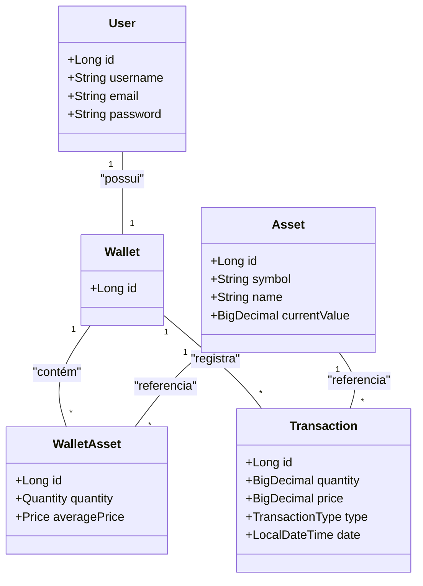
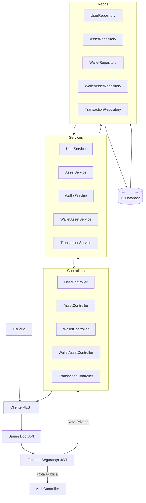

# Sprint - API de Gerenciamento de Carteira de Ativos

[](https://www.oracle.com/java/technologies/javase/21-all-changelog.html)
[](https://spring.io/projects/spring-boot)
[](https://junit.org/junit5/)

Este projeto é uma API RESTful desenvolvida em Java com Spring Boot para o gerenciamento de uma plataforma de investimentos. Ele permite o cadastro de usuários, criação de carteiras, registro de ativos (como ações ou criptomoedas) e a simulação de operações financeiras.

## Integrantes (Turma 3ESPY - 2025)

| Nome | RM |
| :--- | :--- |
| Fabrício Saavedra | 97631 |
| Guilherme Akio | 98582 |
| Guilherme Morais | 551981 |
| Açussena Macedo Mautone | 552568 |

## Core Features

* **Gerenciamento de Usuários:** CRUD completo de usuários (com criação automática de carteira).
* **Gerenciamento de Ativos:** CRUD completo para registrar novos ativos (ações, criptos, etc.).
* **Operações de Carteira:** Funcionalidades de `buy` (comprar), `sell` (vender) e `update` (atualizar) ativos dentro da carteira de um usuário.
* **Histórico de Transações:** Listagem de todas as transações por carteira ou por ativo.
* **Segurança:** Autenticação e autorização via JWT (RSA) e hashing de senhas com BCrypt.
* **Testes:** Suíte de testes de integração (`@SpringBootTest`) 100% funcional.

## Tecnologia Utilizada

* Java 21
* Spring Boot 3.4.6
* Spring Data JPA (Hibernate)
* Spring Security (JWT com chaves RSA & BCrypt)
* H2 Database (Banco de dados em memória)
* JUnit 5
* Maven

## Pré-requisitos

* JDK 21 instalado
* Maven instalado
* IDE de sua preferência (IntelliJ, Eclipse, VS Code)

## Setup e Execução

1.  **Clone o repositório:**
    ```bash
    git clone [https://github.com/Guimeb/Java-API](https://github.com/Guimeb/Java-API)
    ```

2.  **Verifique a configuração (Opcional):**
    O projeto está configurado para rodar com o banco em memória H2. Se necessário, ajuste as propriedades em `src/main/resources/application.properties`:

    ```properties
    spring.datasource.url=jdbc:h2:mem:testdb
    spring.datasource.driver-class-name=org.h2.Driver
    spring.datasource.username=galo
    spring.datasource.password=

    # JWT (requer os arquivos app.pub e app.key no classpath)
    jwt.public-key-location=classpath:app.pub
    jwt.private-key-location=classpath:app.key
    ```

3.  **Execute a aplicação:**
    ```bash
    mvn clean spring-boot:run
    ```

4.  **Acessando os Serviços:**
    * **Swagger UI (Documentação):** `http://localhost:8080/swagger-ui/index.html`
    * **H2 Console (Banco de Dados):** `http://localhost:8080/h2-console`
        * **JDBC URL:** `jdbc:h2:mem:testdb`
        * **Usuário:** `galo`
        * **Senha:** (deixe em branco)

## Executando os Testes

Para rodar a suíte completa de testes de integração e garantir que todos os controllers e serviços estão funcionando como esperado:

```bash
mvn clean test
```

## Guia Rápido de Uso (Fluxo de Operação)

Para utilizar a API, siga esta ordem:

1.  **Obtenha um Token:** Use o endpoint `POST /authenticate` com o usuário padrão (`galo` / `password`) para gerar um token JWT.
2.  **Crie um Usuário:** Use `POST /users` para criar um novo usuário (ex: 'alice'). Uma carteira (`Wallet`) é criada automaticamente para este novo usuário.
3.  **Crie Ativos:** Use `POST /assets` (autenticado) para registrar os ativos que serão negociados (ex: "BTC", "AAPL").
4.  **Opere na Carteira:** Use os endpoints de `WalletAsset` (ex: `POST /users/{alice_id}/wallet/assets/buy`) para adicionar ativos à carteira da 'alice'.

---

## Documentação da API

### Autenticação

Todos os endpoints, exceto `POST /authenticate` e `POST /users`, são protegidos. Você deve enviar o token JWT no *header* `Authorization` em todas as requisições.

**Exemplo:** `Authorization: Bearer eyJhbGciOi...`

---

### 1. Authentication

* **POST** `/authenticate`
    * **Descrição:** Autentica um usuário e retorna um token JWT.
    * **Body:**
        ```json
        {
          "username": "galo",
          "password": "password"
        }
        ```
    * **Response (200 OK):**
        ```json
        {
          "token": "eyJhbGciOi...",
          "type": "Bearer"
        }
        ```

---

### 2. Users

* **POST** `/users`
    * **Descrição:** Cria um novo usuário e, automaticamente, uma carteira (`Wallet`) associada a ele. Este endpoint é público.
    * **Body:**
        ```json
        {
          "username": "alice",
          "email": "alice@example.com",
          "password": "SenhaForte123!"
        }
        ```
    * **Response (200 OK):** Retorna o usuário criado (sem a senha).

* **GET** `/users`
    * **Descrição:** (Protegido) Lista todos os usuários cadastrados (sem as senhas).

* **GET** `/users/{id}`
    * **Descrição:** (Protegido) Busca um usuário por seu ID (sem a senha).

* **PUT** `/users`
    * **Descrição:** (Protegido) Atualiza os dados de um usuário.
    * **Body:**
        ```json
        {
          "id": 2,
          "username": "alice_silva",
          "email": "alice.silva@example.com",
          "password": "NovaSenhaForte123!"
        }
        ```

* **DELETE** `/users/{id}`
    * **Descrição:** (Protegido) Remove um usuário e (em cascata) sua carteira e ativos associados.

---

### 3. Assets

* **POST** `/assets`
    * **Descrição:** (Protegido) Cria um novo ativo (ação, criptomoeda, etc.) no sistema.
    * **Body:**
        ```json
        {
          "symbol": "BTC",
          "name": "Bitcoin",
          "currentValue": 60000.00
        }
        ```

* **GET** `/assets`
    * **Descrição:** (Protegido) Lista todos os ativos disponíveis para negociação.

* **GET** `/assets/{id}`
    * **Descrição:** (Protegido) Busca um ativo por seu ID.

* **PUT** `/assets`
    * **Descrição:** (Protegido) Atualiza os dados de um ativo.

* **DELETE** `/assets/{id}`
    * **Descrição:** (Protegido) Remove um ativo do sistema.

---

### 4. Wallet

* **GET** `/users/{userId}/wallet`
    * **Descrição:** (Protegido) Retorna as informações da carteira de um usuário (sem listar os ativos).
    * **Response (200 OK):**
        ```json
        {
          "id": 1,
          "userId": 2
        }
        ```

---

### 5. Wallet Assets (Operações)

* **POST** `/users/{userId}/wallet/assets/buy`
    * **Descrição:** (Protegido) Adiciona um ativo à carteira do usuário (compra). Cria ou atualiza o `WalletAsset` e registra uma `Transaction`.
    * **Body:**
        ```json
        {
          "assetId": 1,
          "quantity": 0.5,
          "purchasePrice": 30000.00
        }
        ```

* **POST** `/users/{userId}/wallet/assets/sell`
    * **Descrição:** (Protegido) Remove uma quantidade de ativo da carteira (venda). Atualiza o `WalletAsset` e registra uma `Transaction`.
    * **Body:**
        ```json
        {
          "assetId": 1,
          "quantity": 0.25,
          "purchasePrice": 31000.00
        }
        ```

* **PUT** `/users/{userId}/wallet/assets/update`
    * **Descrição:** (Protegido) Atualiza manualmente a posição de um ativo na carteira (ex: para importação de dados).
    * **Body:**
        ```json
        {
          "walletAssetId": 1,
          "quantity": 0.75,
          "averagePrice": 32000.00
        }
        ```

* **GET** `/users/{userId}/wallet/assets`
    * **Descrição:** (Protegido) Lista todos os ativos (posições) dentro da carteira de um usuário.

---

### 6. Transactions

* **GET** `/transactions/wallet/{walletId}`
    * **Descrição:** (Protegido) Lista o histórico de todas as transações (compras e vendas) de uma carteira específica.

* **GET** `/transactions/asset/{assetId}`
    * **Descrição:** (Protegido) Lista o histórico de todas as transações de um ativo específico em todas as carteiras.

---

### 7. Private (Exemplo)

* **GET** `/private`
    * **Descrição:** Rota de exemplo para testar a autenticação.
    * **Response (200 OK):** "Hello from private API controller"

## Segurança

* **Autenticação:** Endpoints são públicos (`/authenticate`, `POST /users`) ou privados.
* **Autorização:** Endpoints privados exigem um Token JWT válido (assinado com RSA) no *header* `Authorization`.
* **Senhas:** Senhas são armazenadas no banco de dados usando o *hash* BCrypt. Elas **nunca** são retornadas em nenhuma resposta da API.

## Tratamento de Erros (Status HTTP)

* `200 OK`: Requisição bem-sucedida.
* `400 Bad Request`: Erro de validação nos dados enviados (ex: campo faltando, e-mail inválido).
* `401 Unauthorized`: Token JWT ausente, expirado ou inválido.
* `404 Not Found`: Recurso não encontrado (ex: `GET /users/999`).
* `500 Internal Server Error`: Erro inesperado no servidor.

## Diagramas

### Diagrama de Classes (Entidades)



### Fluxograma da Arquitetura

